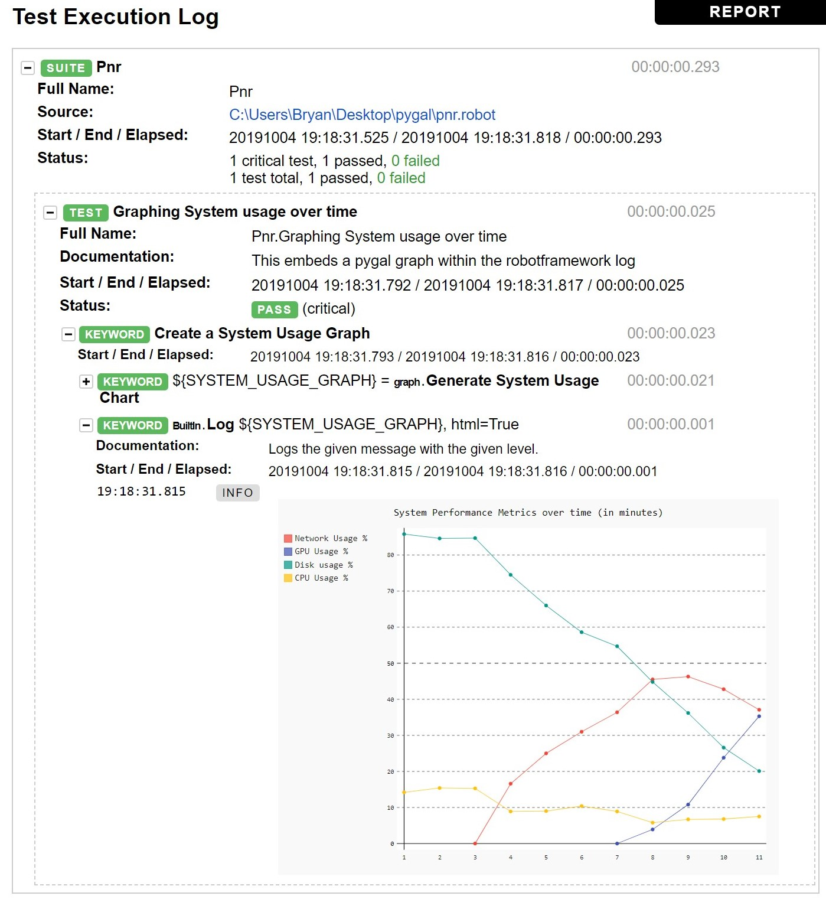

# robot-framework-graphing-poc
🤖📈 A Proof of Concept of how to make Robot Framework logs more informative  

Robot framework allows for svg and html elements to be embedded in logs.  
This a simple example of how it can be used.  
A good use of this would be to plot JavaScript Heap Memory or CPU usage over time for Performance and Reliability testing.

### Run test
* Ensure that [Robot Framework](https://robotframework.org/) and [Pygal](http://pygal.org/) are both installed
* Execute the following
```Bash
robot pnr.robot
```
* Open log file
### Log file
